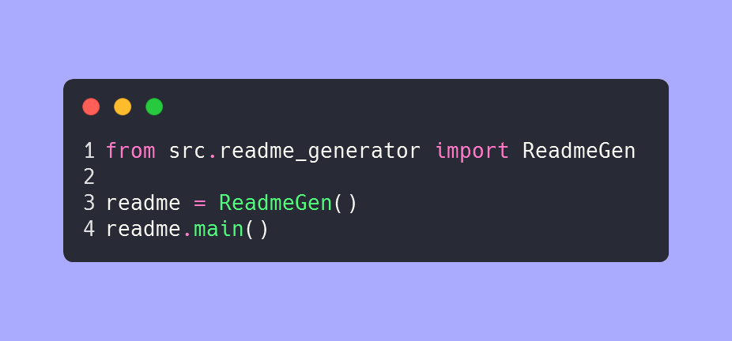

 
# readme-generator

<!-- Badges: Project Status GitHub -->

<!-- Badges: Tools used -->
`python` `just` `jinja2` `gig` `powershell` `git` `git-lfs` 

## Documentation 🗎

The project genrates readme for github repo.  

## Features 🌟

- add badges to readme. 
- add feature list. 

## Getting Started 🌱

Run `just` cmd in command prompt.

✨[Report a 🐛 or Request a ⭐](https://github.com//readme-generator/issues)✨

Copyright :copyright: 2024 CK :tm: @ charudatta10.   

<!-- Acknowledgment, References, Misc -->
