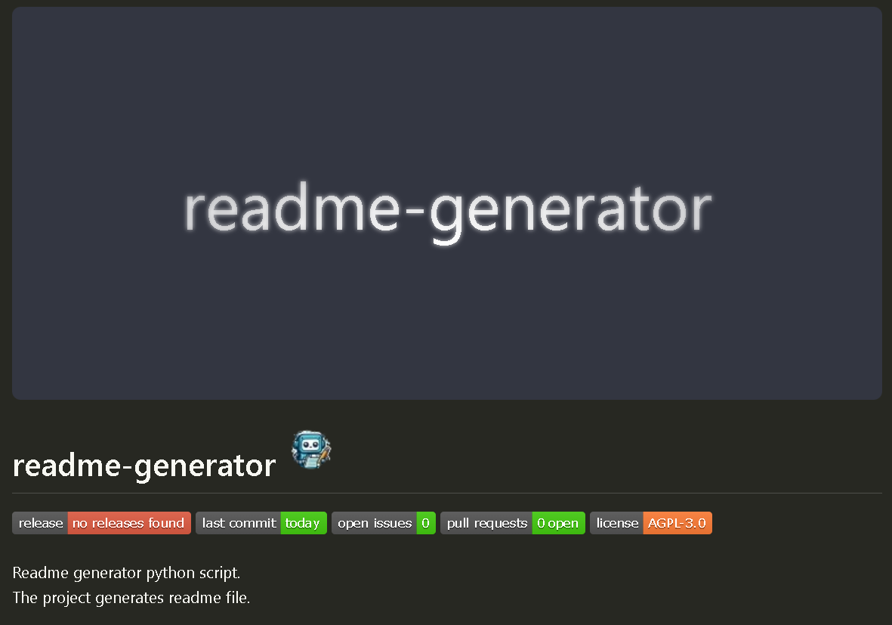
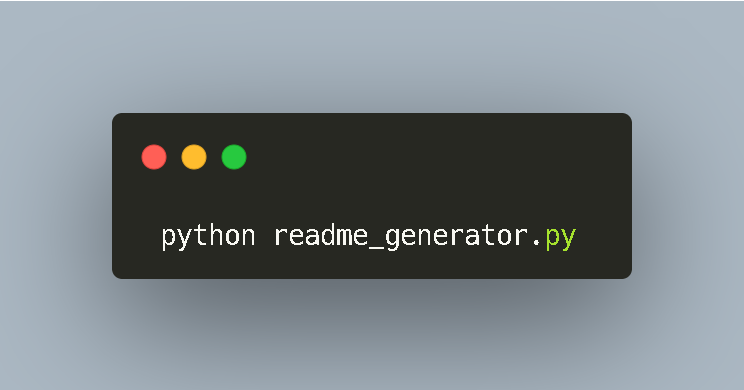

 
<!-- PROJECT Banner .png)-->

<!-- PROJECT TITLE --> <!-- <a name="readme-top"></a> -->
# {title} <!-- PROJECT LOGO .png) -->

<!-- PROJECT SHIELDS -->


<!-- Project Description -->
{description}  

<!-- SHARING ON SOCIAL MEDIA -->

<!-- TABLE OF CONTENTS -->

## Project Preview 📖 <!-- Usage screenshots -->



<!-- <p align="right"><a href="#readme-top">Jump to Top</a></p>
-->

## Features 🌟

{features} 

## Built With 🔧
{list_badges}

<!-- GETTING STARTED -->

## Getting Started 🌱

### Dependencies ⧉

{dependencies}

### Installation ■■■■■■■■■■

1. To install from binaries:  
   Download the binary file from the release and double-click to use it.

2. To install from source:

```PowerShell
gh repo clone charudatta10/{title}
```
 
### How to use 🗎

{steps}




## FAQ ?

✨[Report a 🐛 or Request a ⭐](https://github.com/charudatta10/{title}/issues)✨

{FAQ}

<!-- CONTRIBUTING -->

## Authors 👱

The author of this project is @charudatta10.  

## Contributors 👪

|  |
| :---: | 
| Charudatta Korde |
| [💻](#code-charudatta10)  [📖](#doc-charudatta10)  [🎨](#design-charudatta10)  [💡](#example-charudatta10)  [🤔](#ideas-charudatta10)|


### Contribution guidelines

The contribution to this project should adhere to GPL-3.0 and respect the copyright claims of charudatta10.

## License 📜

Copyright :copyright: 2024 :tm: @ charudatta10.   
The project is licensed [GPL-3.0](./LICENSE).